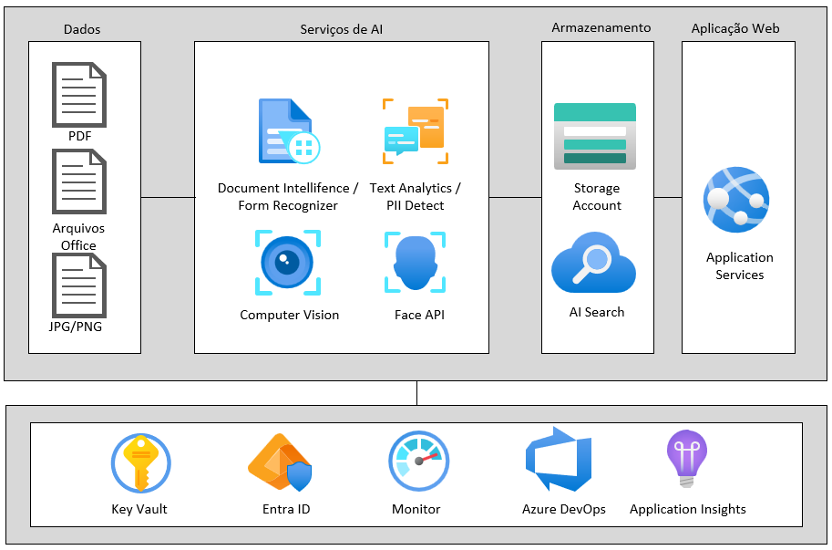
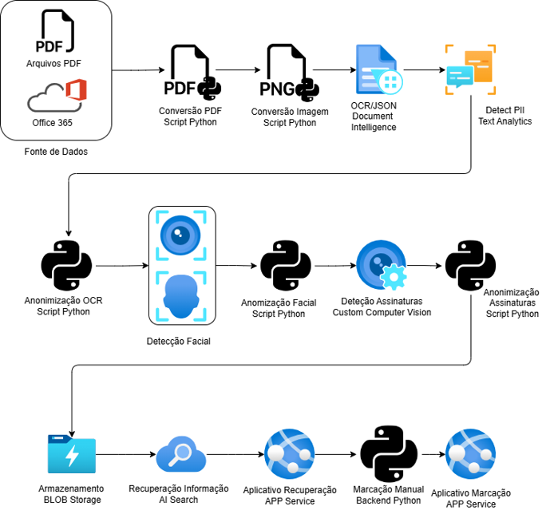

# Anonimizer

## Descrição
Este projeto tem como objetivo a anonimização de documentos utilizando os serviços da Azure. A anonimização é o processo de remover ou obscurecer informações pessoais identificáveis (PII) de documentos para proteger a privacidade dos indivíduos.

## Funcionalidades
- **Anonimização de Texto**: Remoção de informações pessoais de documentos de texto.
- **Suporte a Múltiplos Formatos**: Suporte para documentos em formatos como PDF, DOCX, TXT, etc.
- **Integração com Azure**: Utilização de serviços Azure AI Services para detecção e anonimização de PII.
- **Interface de Usuário**: Interface amigável para upload e processamento de documentos.

## Pré-requisitos
- Conta na Azure
- Python => 3.9

## Instalação
1. Clone o repositório:
    ```bash
    git clone https://github.com/gilbertossoares/anonimizer.git
    ```
2. Navegue até o diretório do projeto:
    ```bash
    cd anonimizer
    ```
3. Instale as dependências:
    ```bash
    pip install -r requirements
    ```

## Configuração
1. Crie um arquivo `.env` na raiz do projeto e adicione suas credenciais da Azure:
    ```plaintext
    AZURE_STORAGE_CONNECTION_STRING=
    INPUT_CONTAINER_NAME=
    OUTPUT_CONTAINER_NAME=
    AZURE_AI_SEARCH_ENDPOINT=
    AZURE_AI_SEARCH_KEY=
    AZURE_COMPUTER_VISION_ENDPOINT=
    AZURE_COMPUTER_VISION_KEY=
    AZURE_CUSTOM_COMPUTE_VISION_ENDPOINT=
    AZURE_CUSTOM_COMPUTE_VISION_PREDICTION_KEY=
    AZURE_DATALAKE_ACCOUNT_NAME=
    AZURE_FORM_RECOGNIZER_ENDPOINT=
    AZURE_FORM_RECOGNIZER_KEY=
    AZURE_TEXT_ANALYTCIS_ENDPOINT=
    AZURE_TEXT_ANALYTICS_KEY=
    ```

## Uso
1. Inicie o servidor:
    ```bash
    python app.py          
    ```
2. Acesse a interface de usuário em seu navegador:
    ```plaintext
    http://localhost:5000
    ```
3. Faça upload de um documento e inicie o processo de anonimização.

## Arquitetura
Este projeto utiliza da seguinte arquitetura:



## Workflow
O fluxo de trabalho a seguir é o passo a passo pelo caminho do arquivo através da solução.



## Licença
Este projeto está licenciado sob a [MIT License](LICENSE).
